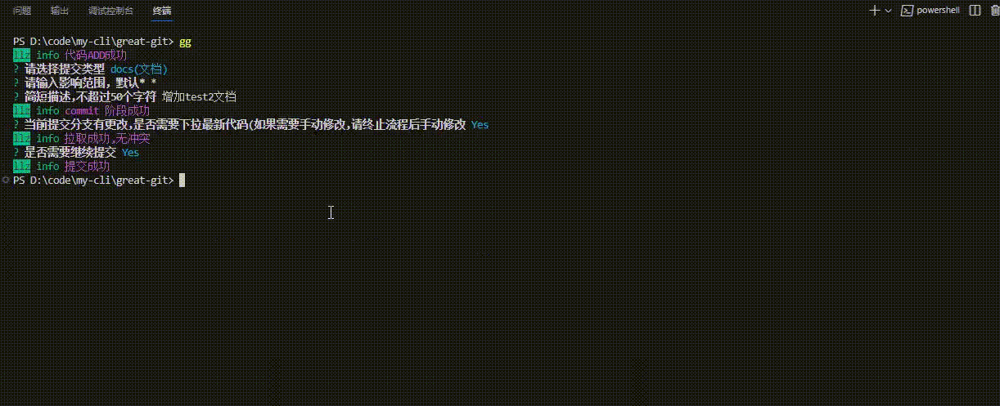

# GREAT GIT
更方便 更快捷的使用git

### Installation

<a name="installation"></a>

```shell
npm install @llzcli/great-git-cli -g
```

### Use
```shell
gg
```

通过gg命令 你可以自动完成git add  git commit  git push 以及push遇到冲突时重新提交的一键操作

### 亮点

#### 规范化的COMMIT信息
参考阿里提出的git commit规范 让你不用再去关心commit格式 只需要关注你所需要的提交信息

#### 可配置的git命令
现有三种命令可以提供配置功能 分别是
- git add阶段的命令
- git push命令
- git pull命令
你可以通过以下方式进行配置
```shell
gg config set <command> <targetCommand>
```
例如
```shell
gg config set pull "git pull -r"
```

#### 一键操作式的git冲突重新提交
在你提交发现目标分支有冲突或者新提交时，你都可以通过命令行的方式去一键重新提交，
且如果有冲突 你的下一次提交commit type默认会选择merge，做到规范化提交,like this
##### 无冲突

##### 有冲突


#### 积极维护中
本工具正在积极维护中 如有ISSUE或BUG 请提交到上方GIT仓库中 作者会在看到时第一时间解决~